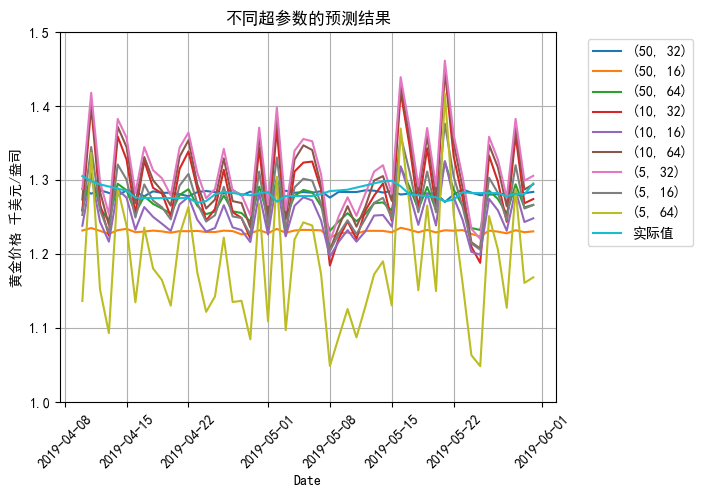
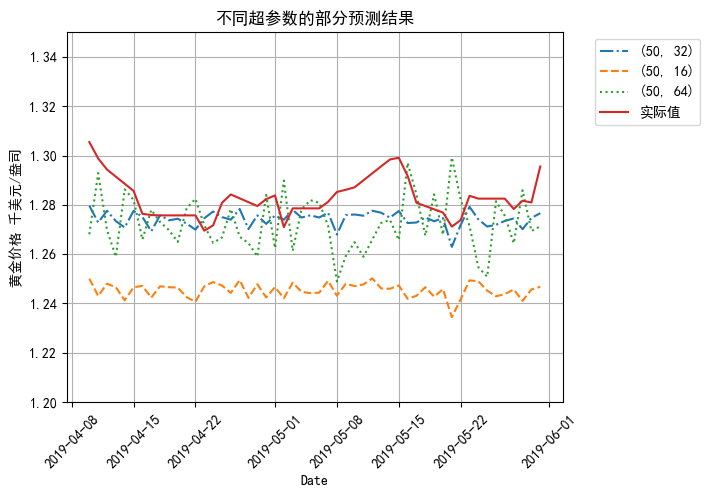
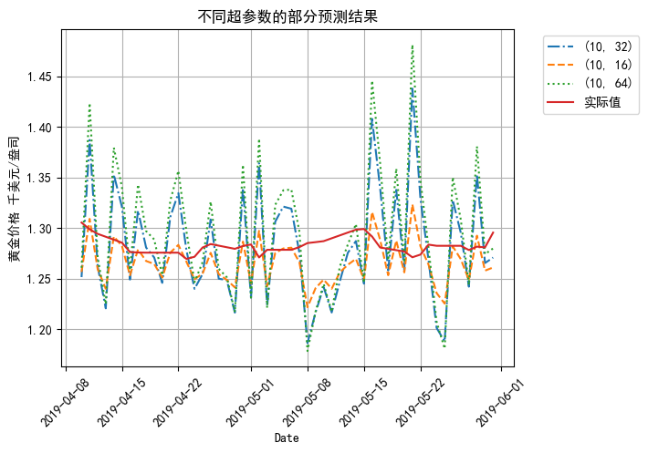
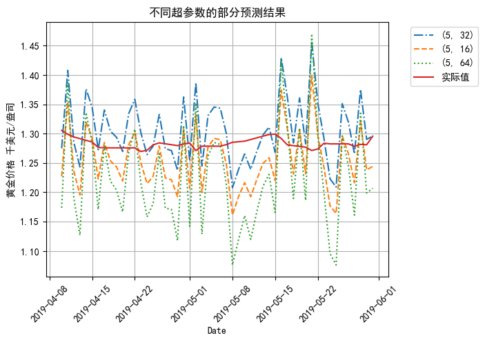
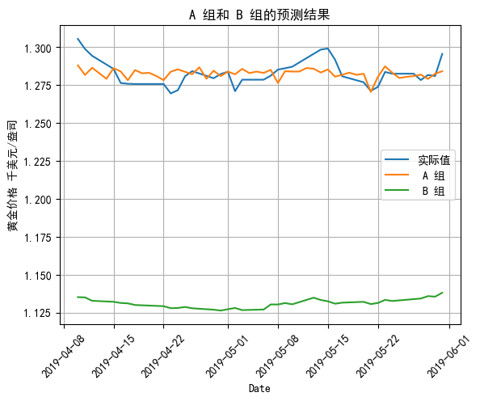
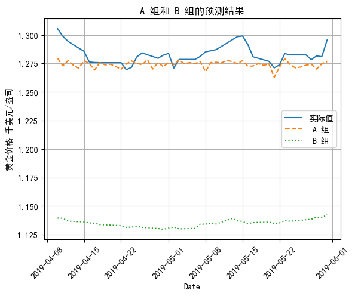
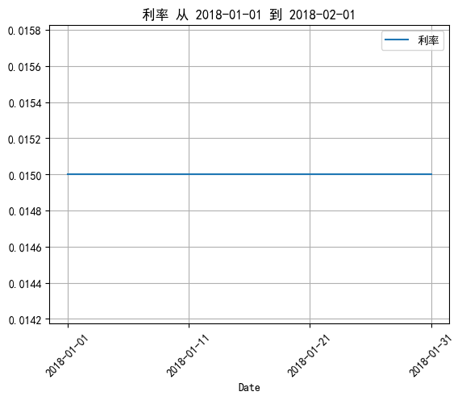

# 摘要

本研究旨在探讨全球事件对黄金价格波动的影响，并基于深度学习模型提出了一种综合分析框架。通过整合传统因素数据和全球事件数据，采用长短期记忆（LSTM）模型，并利用全球事件数据集（GDELT）以及传统因素数据对黄金价格进行预测分析。在实验中，将模型分为A组和B组，A组综合考虑了传统因素数据和全球事件数据，而B组仅使用传统因素数据。实验结果显示出全球事件在黄金价格波动分析中拥有更大的发展空间和更广阔的前景。本研究为了解黄金价格波动规律提供了新的思路和方法，具有重要的理论和实践意义。

关键词：黄金价格；全球事件；深度学习；长短期记忆（LSTM）；GDELT数据库

# Abstract

This study aims to investigate the impact of global events on the fluctuations of gold prices and proposes a comprehensive analytical framework based on deep learning models. By integrating traditional factor data and global event data, the Long Short-Term Memory (LSTM) model is employed, utilizing the Global Database of Events, Language, and Tone (GDELT) dataset along with traditional factor data for the prediction and analysis of gold prices. In the experiments, the models are divided into Groups A and B, where Group A integrates both traditional factor data and global event data, while Group B only uses traditional factor data. The experimental results demonstrate that global events have greater potential and broader prospects in the analysis of gold price fluctuations. This study provides new insights and methods for understanding the patterns of gold price fluctuations, with significant theoretical and practical implications.

Keywords: Gold prices; Global events; Deep learning; Long Short-Term Memory (LSTM); GDELT database

# 目录

# 1 绪论

## 1.1 背景介绍

### 1.1.1 全球金融市场中黄金的重要性

黄金在全球金融市场中发挥着相当重要的作用，根据相关研究[1]，黄金的主要重要性体现在以下几个方面：

#### (1) 避险资产

黄金通常会作为避险资产使用。有研究指出，当金融市场出现波动或不确定性增加时，投资者往往会转向黄金以保护其资产[2]。黄金在历史上表现出较强的稳定性决定了这一性质，尤其在金融危机期间更是如此。

#### (2) 对冲通胀

黄金被认为是对抗通胀的有效工具。当货币购买力下降时，黄金的价值通常会上升，因而成为对抗通胀的有效手段。实证分析表明，黄金依然是对冲通胀的良好工具[3]。

#### (3) 金融保值

理论研究证明，作为实物货币的黄金，价值稳定性是其内在的一个特征。相比会带来贬值风险的信用货币而言，在通货膨胀时期，黄金是一种具有良好效应的对冲工具。有学者研究了黄金的长期保值功能，认为黄金可以长期保持价值稳定性，并且对消费品和中间产品的实际购买力也保持稳定[4]。

综上所述，对黄金价格波动因素的分析具有重要意义。

### 1.1.2 传统金融研究中的局限性

#### (1) 数据时间滞后性

传统金融研究通常依赖于官方发布的经济数据和统计数据，例如矿产、黄金生产、工业需求等。这些数据[3]往往具有时间滞后性，无法实时反映市场变化。此外，数据的准确性也可能受到统计方法和数据收集过程的影响，从而限制了研究结果的可靠性。

#### (2) 静态分析

传统金融研究往往基于历史数据进行静态分析，忽略了市场动态变化和突发事件的影响。同时，往往使用的数据是以年或者月为单位，而黄金的价格往往是实时变动的，容易忽视绝大部分的价格波动。例如，使用的数据[5]包括道琼斯指数、美国消费价格指数、名义有效汇率、美国联邦资金利率、世界黄金储备，以上均是以年为跨度。这样的分析方法可能无法充分捕捉市场的实时波动和复杂性，从而影响预测的准确性。

本项目旨在尝试尽可能摆脱以上所述的局限性，并提出另一个处理和分析的方向。

## 1.2 研究目的和方式

### 1.2.1 深入探究全球事件对黄金价格的影响

研究全球事件涉及不同客体之间的关系，这些关系往往是具有复杂性和多维性，没有一个统一的标准去衡量。经验、直觉和理论倾向带来的影响往往会导致不同研究者对事件的看法存在差异。如果能够采用量化研究在一定程度上就可以解决此问题。从理论上讲，如果拥有了统一对所有事件进行分析的能力，就有机会和可能性去把握它们之间的关系。那么就可以得出，如果能够使用统一的测量标准对所有事件进行评估，然后将这些评估结果综合起来，就能够量化这些关系。

本项目旨在探讨全球事件带来的全球局势变化对黄金价格的影响。但如何量化汇总全球局势的变化无疑是一个需要尝试解决的问题。随着全球化的深入和信息技术的飞速发展，大数据分析成为揭示复杂市场关系的有力工具。在这一背景下，GDELT数据库作为一个全球事件数据的宝库，通过它能够获得量化之后的全球事件数据。这为我们提供了机会，通过深度学习模型更全面地分析全球事件与黄金价格之间的关系。利用GDELT数据库，我们可以获取全球各地的多语言、多媒体形式的全球事件数据，实现对全球事件的实时性分析，为黄金价格的波动提供另一个角度的解释。

### 1.2.2 应用深度学习模型进行多维度分析

通过使用长短期记忆网络（LSTM）模型，我们可以挖掘GDEL数据库中全球事件与黄金价格之间复杂的关联性模式，揭示潜在的趋势、周期性或突发性事件对黄金价格的影响。这些模式往往是传统非深度学习模型[6] 难以捕捉的。

如果再将全球事件数据与传统的黄金价格波动因素数据[5]（包括道琼斯指数、美国消费者价格指数、美国联邦资金利率）进行综合考虑，就能形成更为完整的分析框架，有助于更全面地理解黄金价格波动的复杂性。

# 2 相关技术

## 2.1 GDELT数据库介绍

GDELT（Global Database of Events, Language, and Tone）数据库是一个全球事件数据库，旨在记录和分析世界各地发生的新闻事件。其数据来源包括在线新闻文章、博客、社交媒体和广播电视新闻等。通过多语言处理技术，GDELT能够捕捉和翻译来自几乎每个国家和地区的新闻报道。

GDELT数据库的核心功能是通过自然语言处理和机器学习技术，对全球新闻事件进行结构化编码。这包括事件的时间、地点、参与者以及事件的性质等信息。此外，GDELT还记录了事件报道的情感基调，使研究人员能够分析全球情绪变化和舆论趋势[7]。

GDELT数据库在许多方面弥补了传统数据的不足。它在记录了全球范围内事件的发生时间、地点、内容和参与者信息的同时，还系统地对各类事件进行了分类以及评分[8]。

## 2.2 LSTM模型介绍

传统的神经网络（前馈神经网络，FNN）是由一系列简单的神经元构成的网络结构。其层级结构特点是每层神经元与下一层神经元全连接，但同一层的神经元之间没有连接。同时FNN的网络结构中也没有环或回路，输出与模型本身也没有反馈连接。在这种结构下，数据从输入层开始，逐层通过网络，直到输出层。因此在FNN中，所有的观测值都是独立且不相关地处理的。但是在实际使用的情况下，所处理的许多任务需要的数据中并不是没有包含大量上下文信息的数据，反而是数据之间会有复杂关联性，正如视频、音频和常见的文本数据等。因此，如果坚持使用FNN处理这些任务，就不可避免很大的局限性，这也是为何其在大规模应用中表现不佳的主要核心原因所在。

循环神经网络（Recurrent Neural Network，RNN）主要用于处理序列数据。它与 FNN 最大的不同之处便是其神经元在某一个时刻的输出是可以被作为输入，使其再一次输入到神经元的，这给他带来了能够保持数据中的依赖关系的能力。尽管 RNN 在设计之初的目的是为了学习长期的依赖性，但大量的实践[9] 表明，标准的 RNN 实际上很难实现信息的长期保存。RNN 存在梯度消失和梯度爆炸的问题，这两个问题都是由于 RNN 的迭代性引起的。总的来说，RNN 在早期也没有得到广泛的应用。

为解决长期依赖的问题，提出了长短期记忆（Long Short-Term Memory，LSTM）网络[10]，用于改进传统的循环神经网络模型。LSTM 与 RNN 并不存在在工作方式上的很大的区别或差异，但其所不同之处在于一个更加细化的内部处理单元，这是 RNN 所没有，而 LSTM 所独有的，它带来了能够有效存储与更新上下文信息的能力。LSTM 目前被广泛应用于序列学习相关的任务中，也成为了现实世界中最有效的序列模型，正是因为该优秀的性质 。

简而言之，LSTM 基本上是一个循环神经网络，能够处理长期依赖关系。例如当你在看番剧中，你可以理解发生任何情况的原因是因为你知晓之前发生的事情，RNN 也是以类似的方式工作，但其存在一个主要问题，即梯度消失问题。梯度消失指的是在训练过程中，随着时间步数的增加，梯度逐渐变得非常小，这带来了模型难以有效学习和记住长期依赖关系的问题。这限制了RNN在处理需要长期依赖的信息时的性能。因此，为了避免这个问题，LSTM 设计了一种特殊的机制，该机制让它真正地拥有了能够去利用这些长距离的时序信息的能力，例如，在故障时间序列预测方面，LSTM 具有显著的效果[11]。

# 3 数据采集与预处理

## 3.1 数据采集

出于数据量大小、所用设备性能和数据获取的难易程度等因素的综合考虑，本项目选择的数据时间段为2018年1月1日至2019年6月1日。

综合各数据的时间跨度和时间精度等因素的考虑，本项目最终采用以天为单位作为单一样本。即通过每天的累积的GDELT数据、每天的道琼斯指数、美国消费者价格指数、美国联邦资金利率作为该项目的特征值，而每天的黄金价格则作为对应的标签。

由于早期布雷顿森林体系的设定，美元与黄金挂钩，即1盎司黄金固定兑换35美元[12]。尽管该体系在1973年瓦解，但美元作为国际储备货币，依然保持了相对较高的稳定性。因此，在本项目中，我们采用美元作为单位来获取黄金价格，以尽可能避免因不同国家间的汇率变动对黄金价格的影响。

GDELT数据库的数据获取：

通过GDELT数据库的下载页面[8]，确定了数据链接的格式为"http://data.gdeltproject.org/gdeltv2/"+time+".export.CSV.zip"。编写Python脚本实现自动下载固定时间范围内的数据集。为提高下载效率，可采用多线程下载的方式。

黄金价格的数据获取：数据来自世界黄金协会[13]。

道琼斯指数的数据获取：数据来自英为财情[14]。

美国消费者价格指数的数据获取：数据来自Trading Economics[15]。

美国联邦资金利率的数据获取：数据来自Trading Economics[16]。

## 3.2 特征提取和数据清洗

### 3.2.1 GDELT库数据的筛选与清洗

GDELT 数据库包含大量特征值，每个 CSV 文件中的数据包含 58 个字段，这些字段分为以下五个部分[8]： **事件 ID 和日期属性（EVENTID AND DATE ATTRIBUTES）** 、 **参与者属性（ACTOR ATTRIBUTES）** 、 **事件行为属性（EVENT ACTION ATTRIBUTES）** 、 **事件地理信息（EVENT GEOGRAPHY）**以及**数据管理字段（DATA MANAGEMENT FIELDS）** 。

基于数据量、设备性能以及本项目的研究重点等因素的综合考虑，本项目仅选择以下特征作为输入变量：

* **B 2 Day** ：记录事件发生的日期，格式为 YYYYMMDD。
* **AD 30 QuadClass** ：该字段指定事件类型的主要分类，所有事件被划分为以下四类之一：1=口头合作，2=物质合作，3=口头冲突，4=物质冲突。
* **AE 31 GoldsteinScale** ：每个事件被分配一个介于 -10 至 +10 之间的数值，用以衡量该事件对国家可能产生的理论影响。需要注意的是，这一评分基于事件类型，而非事件的具体细节，因此小规模和大规模的同类事件将获得相同的评分 [8]。
* **AF 32 NumMentions** ：此属性值表示数据库中所有文章中提及该事件的次数。该值可用于评估事件的重要性：提及次数越多，事件可能越重要。如果事件在报道后引发了广泛讨论，该字段数值将更新（例如，一个事件在几周后可能成为舆论热点，导致大量新闻文章提及；或者在事件一周年时可能再次被广泛报道）[8]。
* **AI 35 AvgTone** ：此属性值表示所有提及该事件的文章的“语气”平均值，范围从 -100（极其消极）到 +100（极其积极）。通常的分值范围在 -10 到 +10 之间，0 表示中立。该值可用于过滤事件的“语境”，从而衡量事件的重要性及其影响。例如，轻微负面语气的暴乱可能是小事件，而极其负面语气的暴乱则表明事件可能更为严重。具有积极分值的暴乱可能表明在上下文中描述了某种积极现象（如暴力事件数量显著减少）[8]。

因为 GDELT 数据库中的数据是每15分钟记录一次，并且不会有确定的数量，因此对该数据还需要将每天中的全部15分钟的数据集继续合并，获得当天发生的所有事件数据集。但是，此时得到的数据集中每个样本实际上是对应的某一个发生的事件，而我们的需求是一个样本对应当天所发生的事件。因此，还需要对当天所有的事件进行合并。另外，LSTM 要求样本的特征数量是固定的，但每天并不会有确定数量的事件发生，因此合并后还需要对当天发生的所有事件进行筛选，确保每一天的事件数量相同。这样一来，我们就成功获得了预处理后的 GDELT 数据，其中每一个样本代表当天发生的部分事件合集，其中每个事件使用了它对应的 QuadClass、GoldsteinScale、NumMentions、AvgTone 值作为该事件的量化代表。

### 3.2.2 黄金数据的处理

成功获取了1978年12月29日至2024年3月25日的黄金美元价格数据，数据来源于世界黄金协会的官方网站 [13]。利用 Python 中的 pandas 库，对获取到的每日黄金价格数据进行了预处理，更改了其中价格数值的格式。针对部分日期数据缺失的情况，采用了插值方法进行填充，确保了每一天的黄金价格数据的完整性。

### 3.2.3 传统因素数据的处理

正如上文所述，这些数据并不是每天更新，甚至并不是按照一个固定的时间间隔更新，但本项目的样本是以天为单位。因此如果直接放入样本作为特征是不可靠的，因为必然会存在很多的缺失空缺。为了解决这个问题，同样采用了插值方法进行填充，确保了每一天数据的完整性。

## 3.3 数据的汇总

当将GDELT库数据和传统因素数据进行汇总时，可以发现尽管GDELT库数据是标准化的，但是传统因素数据不是，因此还需要对汇总后的数据统一进行归一化处理。在本项目中采用的是最小-最大标准化（MinMax Scaling）。它将数据缩放到一个固定的范围 [0, 1] ，使得数据的最小值映射到指定的最小值（0），最大值映射到指定的最大值（1）。

还需要注意到的是，当我们将以上数据缩放到 [0, 1] 中后，而黄金的价格却相较于这些数据很大，也就是标签值远大于特征值，这将会带来一系列问题，比如：

模型性能下降：标签值远大于特征值可能会导致模型对输入特征的变化不敏感，从而降低模型的性能。这是因为模型更关注标签值的变化，而不是特征值的变化。

训练不稳定：标签值远大于特征值可能会导致训练过程不稳定，例如损失函数的值可能会变得很大，导致优化过程不收敛或收敛速度非常慢。

在考虑到这种问题的情况下，本项目采用了更换黄金价格单位的方式来解决，也就是将原有的 美元/盎司 更换为 千美元/盎司。

# 4 模型构建与训练

### 4.1 实验平台

项目使用 Python 语言进行开发，并且选择了 Keras 框架来实现 LSTM 模型。具体实现环境如下表所示：

实验环境配置

| 配置              | 说明                    |
| ----------------- | ----------------------- |
| CPU               | AMD Ryzen 7 4800H       |
| GPU               | NVIDIA GeForce RTX 2060 |
| 内存              | 32GB                    |
| CUDA 版本         | 11.8                    |
| Python 版本       | 3.10.5                  |
| Transformers 版本 | 4.27.1                  |

### 4.2 模型的构建

本项目为了证明全球事件对黄金价格波动的影响，需要有不同方式得到的预测结果进行对照以证明全球事件确实能够对其产生影响。因此，本项目设计了两组实验，实验中的超参数等均保持相同，唯一的不同点为 A 组中每一个样本的标签为传统因素数据和 GDELT 库数据的结合，而 B 组中每一个样本的标签仅为传统因素数据。

在本项目中使用的模型一共有 3 层（两层 LSTM 和一层 Dense），而模型预测性能的评价指标是均方误差（Mean Squared Error, MSE），同时并不能忽视图像可视化带来的评价指标，因为本项目侧重于探索全球事件对黄金价格的影响，因此需要特别关注预测和实际值随时间变化和波动的相似度，并添加了辅助评价指标，平均绝对误差（Mean Absolute Error, MAE）。

### 4.3 模型的超参数选择

关于模型构建的超参数具体如下：

1. 第一层：LSTM 层（50 个单元，返回整个序列的输出）。
2. 第二层：LSTM 层（50 个单元，只返回最后一个时间步的输出）。
3. 第三层：Dense 层（1 个单元，作为输出层）。

模型的部分其他超参数如下所示：

| 参数     | 取值                |
| -------- | ------------------- |
| 训练集   | 70%                 |
| 验证集   | 20%                 |
| 测试集   | 10%                 |
| optimize | adam                |
| loss     | mean_absolute_error |

因为在深度学习中，超参数的选择对模型性能有显著影响。选择适当的超参数通常需要结合实验和经验。因此需要对一些关键超参数进行选择，以得到相对最佳的效果。

在本项目中选择了网格搜索的方式完成超参数的选择。网格搜索（Grid Search）是一种系统的超参数调优方法，它通过在预定义的超参数空间中穷举所有可能的超参数组合，以找到使模型性能最优的超参数设置。因为其背后的逻辑是穷尽的方式，其穷举了所有可能的超参数组合，确保不会错过任何可能的最佳组合。这让其拥有了系统性和全面性的优点和特征。

使用了epochs、batch_size 进行超参数的选择，超参数网格如下表所示：

| 超参数     | 取值 |    |    |
| ---------- | ---- | -- | -- |
| batch_size | 32   | 16 | 64 |
| epochs     | 50   | 10 | 5  |

通过网格搜索的方式利用均方误差作为判断指标，对超参数进行了选择，网格搜索的结果如下图表：

| 超参数取值 | 均方误差               |
| ---------- | ---------------------- |
| (50, 32)   | 0.0001318249705946073  |
| (50, 16)   | 0.001473914016969502   |
| (50, 64)   | 0.00031598532223142684 |
| (10, 32)   | 0.0031914934515953064  |
| (10, 16)   | 0.000868563016410917   |
| (10, 64)   | 0.004615228157490492   |
| (5, 32)    | 0.0036720766220241785  |
| (5, 16)    | 0.0036774449981749058  |
| (5, 64)    | 0.011255278252065182   |

可以注意到，(50,32)这一组超参数取值在均方误差这一标准上表现最好，因此最终batch_size的取值为50，epochs的取值为32。

# 5 实验结果分析与对比

## 5.1 实验结果

利用上文网格搜索得到的超参数对标准化后的时间序列数据训练集建立 LSTM 预测模型。通过相同超参数构建两个模型，再对两个模型进行训练和预测，最终完成了 A 和 B 两组实验，得到了两组不同的预测值结果。

## 5.2 数据分析

首先通过计算实际值、A 组预测值和 B 组预测值对应数组的均方误差、平均绝对误差、均方差结果。

可以发现的是 A 组不论是均方误差还是平均绝对误差都明显优于 B 组，这代表 A 组拥有更强的预测能力。

|     | 均方误差              | 平均绝对误差         |
| --- | --------------------- | -------------------- |
| A组 | 0.0001318249705946073 | 0.009479025467801125 |
| B组 | 0.02194117195904255   | 0.1479691488082592   |

## 5.3 可视化

通过 A 组和 B 组的预测值，可以得到两根不同的曲线，同时再添加实际值对应的曲线。本项目的重点在于对波动的分析，因此还需要关注曲线之间的波动，即趋势的联系和相似度。

观察 A 组曲线，可以显著观察到对于实际值曲线有大幅度波动时，A 组曲线往往也会产生与之对应的大幅度波动情况。尤其是在2019.5.20以后的这一段预测值，能够明显看到 A 组和实际值不光数值上十分接近，在整体的波动趋势上也有着极高的相似度，这正是全球事件对价格波动影响的体现。而当实际值曲线变化幅度很小时，A 组曲线与之对应的是在一个相对很小的范围中波动。

而 B 组，其预测值已经和实际值有着不小的偏差，同时需要注意到 B 组得到的结果相较于实际值的波动性太小。这是因为 B 组中的标签值在天的刻度上有效信息内容太少，导致数据中的信息不够，使用模型很难拟合捕捉。观察 B 组的标签值也可以注意到， B 组中存在样本之间的标签完全相同，例如下图所示的2018-01-01到2018-01-31时间段内，这几个样本的标签（利率）完全相同并不存在差异，但黄金的价格却不同于这几个标签这般毫无波动。因此可以说 B 组忽略了市场动态变化和突发事件的影响，也忽视了绝大部分的价格波动。这正是需要使用 GDELT 库中的数据的原因所在。

因此，在关于对黄金价格波动影响中，全球事件更具有未来发展的潜力和提升空间，A 组模型有更强的学习能力。

# 结论

LSTM等机器学习模型已经广泛应用于生产生活的各个领域，GDELT数据库也在量化社会关系的研究中得到了较大规模的使用。本文提出的基于LSTM模型，使用GDELT数据库中的全球事件和传统因素数据进行综合考虑，形成更为完整的对黄金价格波动的分析框架。同时也有采取使用相同的超参数，只使用传统因素数据所构建的模型作为对比，实验效果对比，得出如下结论：

(1) 将全球事件和传统因素数据综合考虑是一个更有前途和提升的方向，它揭露了深度学习与各个领域的融合交流带来的可发展的机会和能力。

(2) 在仅考虑传统因素数据时，相较于实际值，预测值近似一根没有波动的曲线。这代表特征不足，模型的输入特征太少，无法提供足够的信息来准确预测输出，最终得到的模型丧失了学习能力，这也是传统因素的另一个局限性所在。

但同样还存在一些不足和可优化之处：
(1) 受限于设备能力和时间的约束，并没有使用GDELT数据库中的全部样本，使用样本中也没有使用其对应的全部特征。
(2) 超参数应该存在更有效的选择。

通过这一次的毕业论文，也是再一次让我意识到了深度学习这个方向的广阔和无边际。这也给了我们一个机会，一个尝试和学术做触碰的契机。

# 参考文献

[1] 邹琼，黄金金融功能的研究[D]. 上海: 上海社会科学院, 2014.

[2] 尹力博; 柳依依，黄金是稳定的避险资产吗?——基于宏观经济不确定性的视角[J]. 国际金融研究, 2015(07).

[3] 许斌，黄金和通胀走势关系的实证分析[D]. 江苏: 江苏大学, 2010.

[4] 杨楠; 何皆易，黄金抗通胀功能的阶段性变化及影响因素分析[J]. 上海财经大学学报, 2011(06).

[5] 刘曙光; 胡再勇，黄金价格的长期决定因素稳定性分析[J]. 世界经济研究, 2008(02).

[6] 许立平; 罗明志，基于ARIMA模型的黄金价格短期分析预测[J]. 财经科学, 2011(01).

[7] 沈石; 宋长青; 程昌秀; 高剑波; 叶思菁，GDELT: 感知全球社会动态的事件大数据[J]. 世界地理研究, 2020(01).

[8] The GDELT Project. The GDELT Project, 2024年5月12日, https://www.gdeltproject.org (访问日期: 2024年5月12日).

[9] 杨丽; 吴雨茜; 王俊丽; 刘义理，循环神经网络研究综述[J]. 计算机应用, 2018(S2).

[10] Hochreiter S., Schmidhuber J. Long short-term memory[J]. Neural Computation, 1997, 9(8): 1735-1780.

[11] 王鑫; 吴际; 刘超; 杨海燕; 杜艳丽; 牛文生，基于LSTM循环神经网络的故障时间序列预测[J]. 北京航空航天大学学报, 2018(04).

[12] 布雷顿森林体系的演变与美元霸权[J]. 李向阳.世界经济与政治,2005(10)

[13] World Gold Council. Gold Price History Chart | Gold Price Trends | Goldhub, 2024年5月12日, https://china.gold.org/goldhub/data/gold-prices (访问日期: 2024年5月12日).

[14] 英为财情. 道琼斯指数历史数据, 2024年5月12日, https://cn.investing.com/indices/us-30-historical-data (访问日期: 2024年5月12日).

[15] Trading Economics. 美国 - 居民消费价格指数CPI, 2024年5月12日, https://zh.tradingeconomics.com/united-states/consumer-price-index-cpi (访问日期: 2024年5月12日).

[16] Trading Economics. 美国 - 利率, 2024年5月12日, https://zh.tradingeconomics.com/united-states/interest-rate (访问日期: 2024年5月12日).

# 附录

# 致谢

时间真的过得很快，特别是毕业这一年。我感觉去年找实习的时光仿佛还在昨天，转眼间我也已经快要去上班工作了。回忆这4年，我有一件这4年都没有后悔，甚至这辈子都不太可能后悔的一件事，就是在大二上开学的时候选择了转专业来到了大数据这里。

大数据专业的老师都是在很细心地教导着我们，在此对各位老师表达由衷的感谢。同样也感谢老师们在实验过程中耐心指导，有时候做的一些实验，如果只让我一人去独自完成可能真的能称得上是天方夜谭了。

也不光是学习吧，其实在其他方面老师们也是给了我们很大的支持和鼓励。纪明宇老师真的是很把我们这些同学的未来放在心上，我记得应该是开了有不下3次会吧，都是在鼓励和指导我们尽早选择未来的方向，这点真的很难得，因为在后来，我身边也会遇见很多人忙忙碌碌不知方向地度过了自己的大学时光。

同样在此尤其要感谢我的指导老师王育英老师，我这人确实是比较拖延，如果没有王育英老师不厌其烦的催促和仔细地分析，我可能也早就虚度了光阴，最终也无法完成本论文的撰写工作。在此再次感谢王育英老师。

此外我要感谢我来到东北林业大学新认识的各位朋友们，在我困难的时候与我分担痛苦，一起解决问题。

同样也要感谢我的亲人们，没有他们在背后的默默支持，我也不可能勇往直前。

最后，由于我的学术水平有限，所写论文难免有不足之处，恳请各位老师和同学提出批评和指正。
